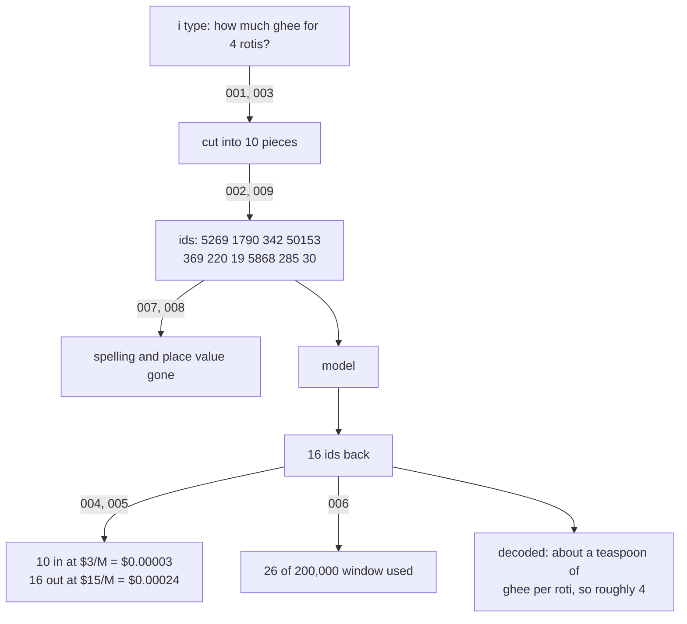

# 010: what the model sees, and what it costs, when i send a request
builds on: [001](./001-characters-vs-words.md), [002](./002-what-a-token-is.md), [003](./003-bpe-merging-by-frequency.md), [004](./004-tokens-are-money.md), [005](./005-hindi-gujarati-cost-more.md), [006](./006-context-window.md), [007](./007-cant-count-letters.md), [008](./008-numbers-get-chunked.md), [009](./009-space-and-capital-change-ids.md)
arc: how machines read text (10 of 10), ~2 min

nine notes in, and theres no new idea in this one. im sending one real request and pointing at the note that explains each step.

the string in the top box is the only text in this whole picture. one box down its ten pieces, one more and its ten integers, and thats what goes over the wire. 001 ruled out splitting by character and by word, 003 built the vocabulary by merging frequent pairs, 002 turned the pieces into ids.

two of those ids you have already seen. 5868 is `" rot"`, space and all, straight out of 009's table. 19 is `"4"`, the same token 008 pried out of 1234. different sentence, same numbers, because the vocabulary is a fixed hashmap that doesnt adapt to what i typed.

now look at what the model doesnt get. ghee arrived as `" g"` and `"hee"`, so the letters are gone (007). ask it to spell ghee backwards and its guessing. the 4 is its own token with no column to line up against (008).

then the money. ten in cost $0.00003, sixteen out cost $0.00024. the reply is six tokens longer than my question and cost eight times more. i knew from 004 that output is priced higher. seeing it as 8x on a two line exchange still got me. 005 is the reminder that ten isnt fixed, the same question in gujarati counts higher. 006 is the ceiling all 26 sit under.

one thing i hit pulling these ids myself. the space before the 4 came out as its own token instead of riding on the front like 009 said. digits get their own rule, which 008 warned about.

heres what i didnt have back at 001. the price, the window, the letter counting, the shaky math, none of them are separate topics. theyre all downstream of where the scissors landed.

arc 2 changes the question. the model has 5868, so what does it do with it? the id turns out to be a lookup key, and it points at a list of numbers.
