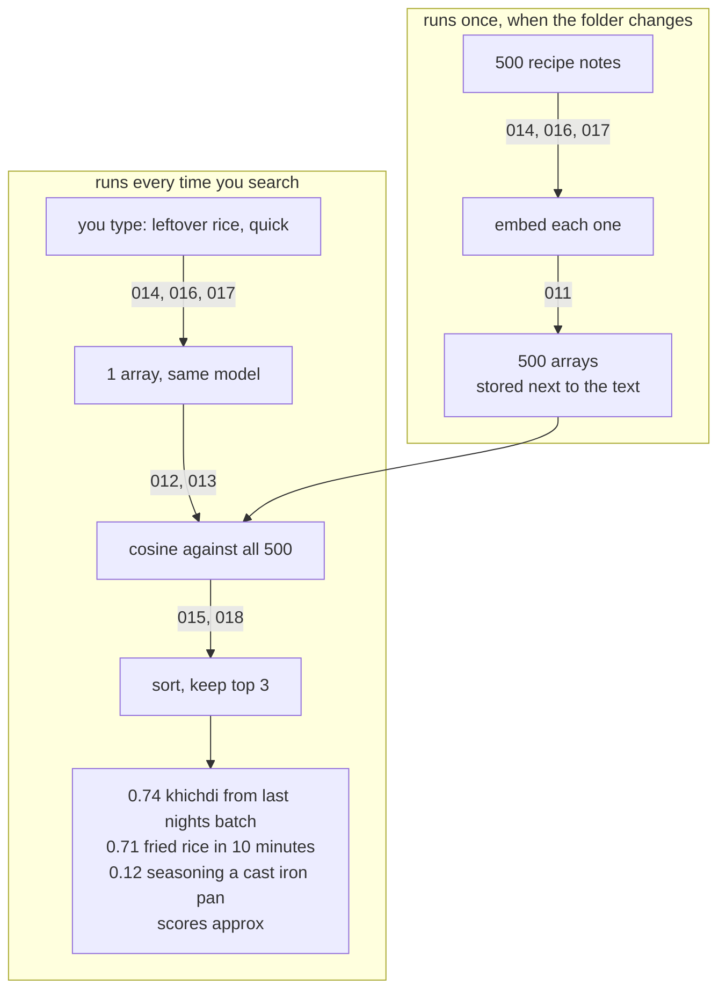

# 021: how search by meaning works, end to end
builds on: [011](./011-a-vector-is-a-list-of-numbers.md), [012](./012-dot-product-by-hand.md), [013](./013-cosine-similarity.md), [014](./014-what-an-embedding-is.md), [015](./015-nearby-means-similar.md), [016](./016-one-word-many-meanings.md), [017](./017-embedding-model-is-separate.md), [018](./018-classify-with-no-training.md), [019](./019-near-duplicates-and-a-threshold.md), [020](./020-clustering-no-labels.md)
arc: meaning as numbers (11 of 11), ~2 min

020 was the last brick. back in 018 i admitted i had this whole arc filed under search, and search is the one thing i never actually built. turns out theres nothing left to invent.

the top half runs once, not per search. every note in my recipe folder goes through embed() and comes back a fixed width array (014, 011), and i store that array right next to the text. 500 of those is a rounding error on the bill, 017's two cents a million tokens.

the bottom half is what happens when you type. one embed call on the query, and it has to be the same model as the top half, floats from a different one dont line up with these (017). then cosine against all 500 (013, which is 012 with a division on it), sort, keep the top few. 018's max() was this with the top set to one.

now read row one. it doesnt say rice, it doesnt say leftover. keyword search never finds that row. 015 showed zero shared words beating three shared words and i filed that under interesting. this is it being useful. 016 is in there too. batch is a cron job to me most days, but sitting next to last nights in a recipe folder it isnt.

couple of honest bits. row three is junk and it shipped anyway, top 3 always returns 3, same trap max() had. and theres no threshold in here, scores only get compared to each other, the lesson 019 charged me thirty hand-labeled pairs for.

018, 019, 020, then this one. i expected search to be the big one in the arc and it came out the smallest.

the loop over all 500 is where this breaks. free at 500, not at 5 million, and arc 6 has the note on what you build instead.

arc 3 changes the question. this whole arc treated the model as a thing that turns my text into floats. next it has to hand words back, and i want to know how.
