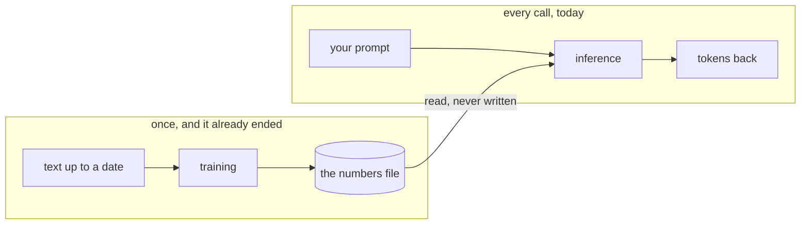

# 028: the numbers got frozen on a date

builds on: [027](./027-what-bigger-actually-buys.md), [026](./026-every-number-every-token.md), [022](./022-guess-the-next-token.md)
arc: whats inside the box (7 of 10), ~2 min

027 said the extra parameters buy more memorized text. so when did the memorizing happen.

two different events, and i had them blurred into one.

training is the lane that already ended. run 022s guessing game over an enormous pile of text where the answer is already there, nudge the numbers whenever the guess is off, repeat for weeks on thousands of chips. 025 asked who set those values, thats it. out comes the file, and the pile it read had a last day.

inference is the other lane, and you already know it, its 026s loop. load the file, read the numbers, write a token, read them again, write the next one. read, every time. never write.

so the file has a date on it. ask about a library version that shipped after that day and you get a confident answer about the old api. thats what was in the pile.

you can paste todays docs in, or let it search and paste them for you, and it will use them. thats text riding along in the request. the file doesnt move, and new numbers only come from someone running training again.

i had a vague picture of it topping itself up as people talked to it. it doesnt. every chat you have ever had started from the same frozen file.

though that pile was just text off the internet, nobody in it was answering me. 029 is how it learned to do that.
