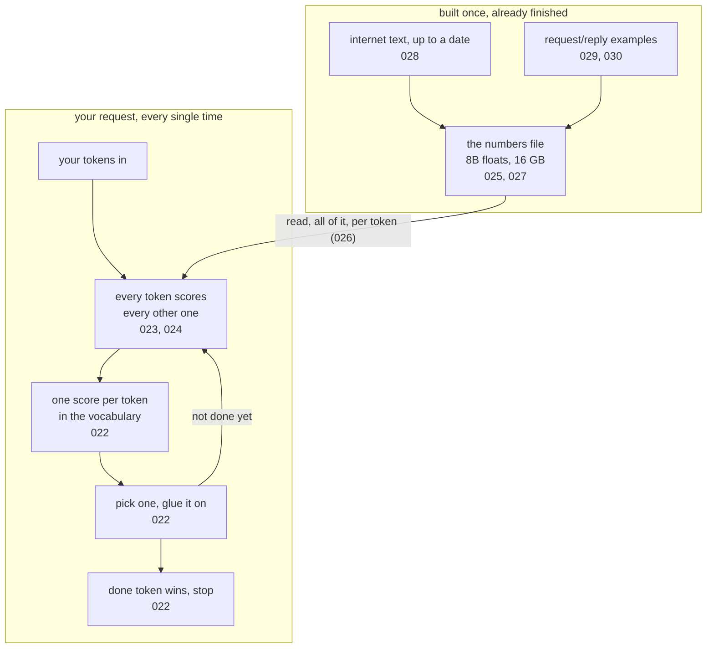

# 031: the box, closed

builds on: [022](./022-guess-the-next-token.md), [023](./023-attention-every-token-looks.md), [024](./024-twice-the-input-four-times-the-work.md), [025](./025-a-parameter-is-one-number.md), [026](./026-every-number-every-token.md), [027](./027-what-bigger-actually-buys.md), [028](./028-numbers-frozen-on-a-date.md), [029](./029-base-model-doesnt-answer.md), [030](./030-fine-tuning-shape-not-facts.md)
arc: whats inside the box (10 of 10), ~2 min

030 left me with a knowledge problem to hand off somewhere else. before i go looking for where, heres the whole box in one picture, and then im done with the inside of it.

the top box happened without you and it already finished. an enormous pile of text ran through 022s guessing game, nudging numbers every time the guess came out wrong (028). then a tiny pile of request/reply pairs ran the same game again, which is the only reason it answers you instead of writing your next three questions (029, 030). out fell one file. 025 is the bit i keep saying back to myself, theres nothing in there but numbers. no rules, no facts table, no lookup.

now the arrow between the two boxes. read, all of it, once per token, never written back (026). i think thats the single most useful line in the arc. the model doesnt learn from your chats, and a 405B model costs more per token out than an 8B one for the boring reason that theres more of it to read (027).

the bottom box is your request and its the same three steps forever. every token scores every other token, so " more" walks out knowing about roti (023), and thats why doubling your input quadruples the work (024). out comes one score per token in the vocabulary, something picks one, glue it on the end, run the whole thing again (022).

so cost has two axes, how much you send and how big the box is. quality is a bigger pile of the same guessing, theres no size where it flips into understanding (027). and everything it knows froze on a date (028).

nine notes, and i expected the inside to be scarier than this. its a loop over a file that doesnt change.
