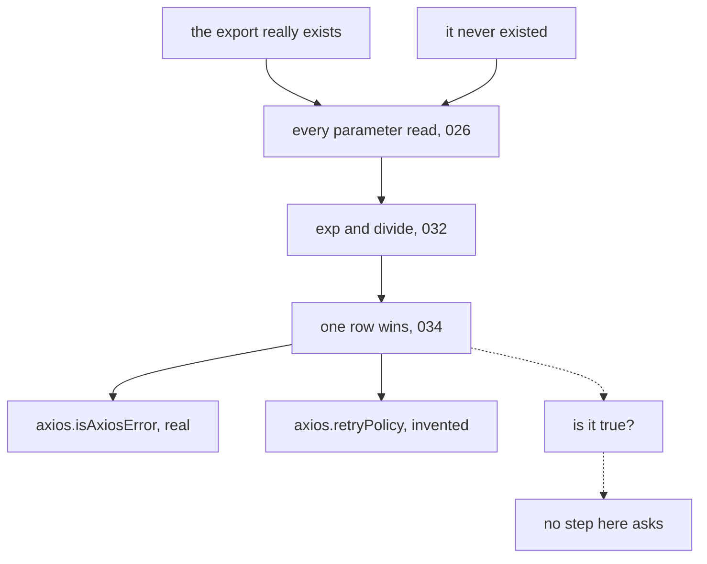

# 038: why the made-up answer sounds right

builds on: [037](./037-no-row-for-i-dont-know.md), [030](./030-fine-tuning-shape-not-facts.md), [026](./026-every-number-every-token.md)
arc: how it writes, and the knobs you own (7 of 12), ~2 min

037 left half the question open. the made-up token comes out, sure, but why does it come out looking so finished? the answer is already in 030. the shape was in all 60 tuning examples, each fact in exactly one. i filed that under fine-tuning at the time. it isnt a tuning thing. its every answer the model has ever written.

axios really does export isAxiosError. it does not export retryPolicy, i made that one up back in 037. but the import line, the camelCase, the argument shape, all of that lives in millions of typescript files, so the model gets it right without breaking a sweat. the one token that had to be a fact was thin. per 037, a row still wins.

heres the part i sat with. walk both paths in that diagram and point at where they differ. the numbers inside differ, sure, different prompt. the steps dont. same parameters read (026), same exp and divide (032), same row winning (034), and no extra step that fires when its inventing.

so theres nowhere to put the if. you cant patch a branch that doesnt exist, and that dotted box is the branch everyone goes looking for.

though 037 did leave a crumb. the invented list topped out at 14%, the real one at 68%. maybe the number itself is the tell? 039 goes at that. it doesnt end well.
