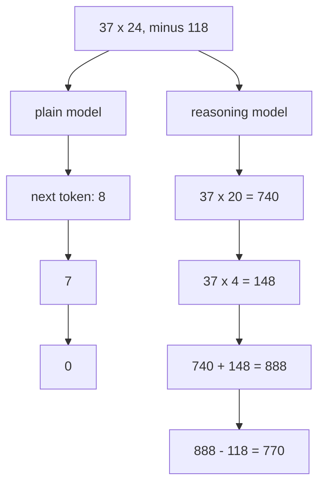

# 042: the model thinks by writing

builds on: [041](./041-same-prompt-two-answers.md), [022](./022-guess-the-next-token.md)
arc: how it writes, and the knobs you own (11 of 13), ~2 min

041 said the loop writes every token off what it already wrote, and i read that as the bad news. its also the only working memory the thing has.

theres no scratch variable in there. nowhere to park 740 while it works out 148. between one token and the next, the only thing the model can still see is the text already on the page. so a half-finished number gets written down or its gone.

now look at the left path. the very next token is the first digit of the answer. it commits to that 8 before any of the working out. it might still land it, these things have read a lot of arithmetic, but its guessing the shape of a number it hasnt computed.

the right path is the same model on the same loop, just spending tokens on the steps first. reasoning models are ones trained to do that on their own, without you asking.

feels obvious now, wasnt this morning. i had reasoning filed under smarter architecture somewhere. its mostly the model talking to itself on the page.

it does all that talking on your bill. thats 043.
