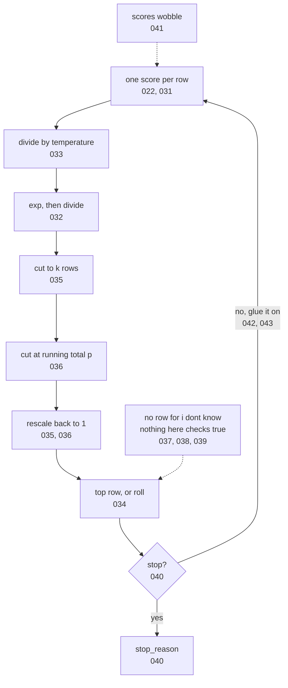

# 044: one tokens journey out, and every knob you own

builds on: [022](./022-guess-the-next-token.md), [031](./031-the-box-closed.md), [032](./032-raw-scores-arent-percentages.md), [033](./033-temperature-is-one-divide.md), [034](./034-greedy-vs-sampling.md), [035](./035-top-k-cuts-the-tail.md), [036](./036-top-p-cuts-by-running-total.md), [037](./037-no-row-for-i-dont-know.md), [038](./038-why-the-made-up-answer-sounds-right.md), [039](./039-asking-how-sure-it-is.md), [040](./040-how-the-loop-stops.md), [041](./041-same-prompt-two-answers.md), [042](./042-thinking-by-writing.md), [043](./043-thinking-on-the-bill.md)
arc: how it writes, and the knobs you own (13 of 13), ~2 min

043 closed the last knob in this arc. i had them all filed as a flat list, temperature and top-k and top-p sitting side by side in one request json like they each do their own thing. theyre a pipeline, and the order is most of the point.

the box from 031 finishes its whole job at that first node. one score per row, 100,000 rows, the same ghee list ive been dragging around since 032. everything after it is arithmetic on a list, and its yours.

temperature runs first, one divide on every score before the exp step. same positive divisor on every row, so the gaps stretch or squash and the order cant move (033). then the two steps that make percentages (032). then the knives. k counts rows (035), p adds percentages down the list until it passes your number (036), and if you set both, both apply, so whichever cuts harder decides. rescale what survived, take the top row or roll for one (034).

then the token gets glued on and it all runs again. every pass is one output token on your bill, thinking ones included (042, 043). it goes until the done token wins, or your stop string matches, or the ceiling cuts mid-word (040), and reading the reply wont tell you which.

now the dotted boxes. not one knob in that picture can put a row on the list that wasnt already there (037). nothing in the path asks if the winner is true (038). the winners percentage looks like a confidence score, but it moves when you set k (039).

all you can change is which existing row wins. took me twelve notes to actually believe that. so if none of this fixes a wrong answer, the only thing left to change is what you send in. thats arc 5.
