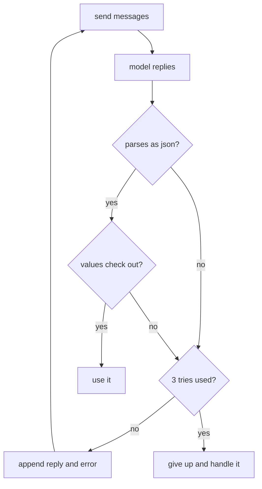

# 050: when the json breaks, validating and retrying

builds on: [049](./049-json-you-can-parse.md), [047](./047-your-code-fakes-the-memory.md), [041](./041-same-prompt-two-answers.md)
arc: the prompt is the program (6 of 11), ~2 min

049 pinned the shape down at the pick, so the json comes back well formed. mine still broke.

two failures in there and they break differently. the parse one is loud, JSON.parse throws and you catch it. even with a schema attached this still happens, hit the max tokens ceiling (040) and the object ends mid-string.

the other is quiet. it parsed, the key is there, and `city` came back as "delhi" for a flight to ahmedabad. shape is not truth (038), so i check the values against what i expected before anything downstream sees them.

the retry is what i got wrong first. i was re-sending the same messages and hoping. 047 already told me the model remembers nothing, so attempt two has no idea attempt one happened unless i put it there myself. append the broken reply and the error string, and the second attempt is reading its own mistake.

then cap it. 041 means the same prompt can fail twice for no new reason, and a while loop with no number in it is your bill.
