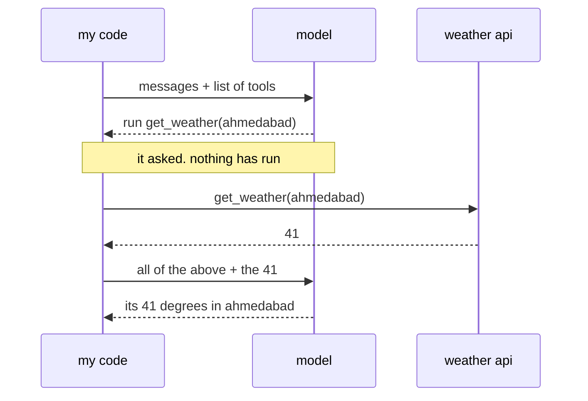

# 051: tool calling, the model asks and your code acts

builds on: [050](./050-when-the-json-breaks.md), [049](./049-json-you-can-parse.md), [047](./047-your-code-fakes-the-memory.md)
arc: the prompt is the program (7 of 11), ~2 min

050 ended with me appending a message onto the array and calling again. tool calling is that same move, except this time im appending an answer to something the model asked me for.

i send the usual messages plus a list of tools, each one a name, a line on what it does, and a json schema for its arguments. same schema idea as 049, so when it wants one, what comes back isnt prose. its json naming the tool and what to pass it.

then nothing happens. the model has no shell and no network, it emitted some json and stopped. whether get_weather actually runs is a call your code makes, and your code holds the api key, so the request that leaves is one you wrote.

the round trip is the bit i kept drawing wrong. i had it filed as the model reaching out and fetching. its two calls with me doing the work in between. the result goes back in as a new message marked as a tool result rather than as me talking, and the whole array replays (047), so the model reads its own ask and my answer to it.

a few providers now host some tools and run them their side. for your own functions, this is the shape.

so my code now runs things the text asked for. 052 is what happens when the text isnt mine.
