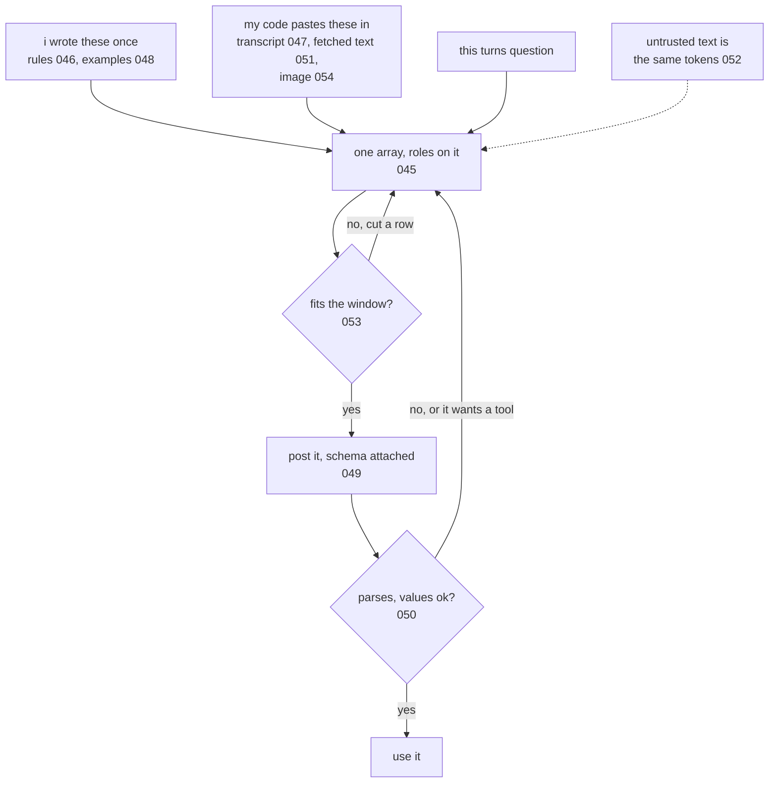

# 055: anatomy of a production prompt

builds on: [045](./045-roles-are-markers.md), [046](./046-system-vs-user.md), [047](./047-your-code-fakes-the-memory.md), [048](./048-showing-beats-telling.md), [049](./049-json-you-can-parse.md), [050](./050-when-the-json-breaks.md), [051](./051-the-model-asks-your-code-acts.md), [052](./052-when-the-text-isnt-mine.md), [053](./053-what-to-leave-out.md), [054](./054-sending-an-image.md)
arc: the prompt is the program (11 of 11), ~2 min

054 was the last part of the request i had no number for. so heres the whole thing in one picture, and what surprised me is how little of it i actually type.

everything lands in one array (045), and flattening it makes one token stream, so no part is structurally special. the rules sit in the system slot because tuning made following that slot a strong lean (046), not because anything compares them.

the top row is the real story though. i wrote the rules and the examples once, they live in a file. everything else my code pastes in fresh on every call. the transcript because the endpoint kept nothing (047), the ticket text because a tool fetched it (051), a screenshot as a second content part (054). so most of what goes out is text i never read.

which is where both loops come from. that fetched text is the same kind of token as my rules, so theres nothing to escape (052), and all i control is how little a followed instruction can reach. it also has a size, and the api rejects the call rather than trimming for me, so cutting is a decision my code makes on purpose (053).

the bottom half is just being careful. the schema cuts down at the pick (049), then i check the parse, then the values (050). a failure goes back to the top with the error appended, because attempt two remembers nothing either. a tool ask takes the same road (051).

if youve only ever written prompts in a text box, heres the shift. theres no prompt string anywhere in that picture. its a function my code runs on every call, same as any request builder id write in typescript, and most of its input isnt mine.

arc 6 is about putting a lot more not-mine text in there, on purpose.
