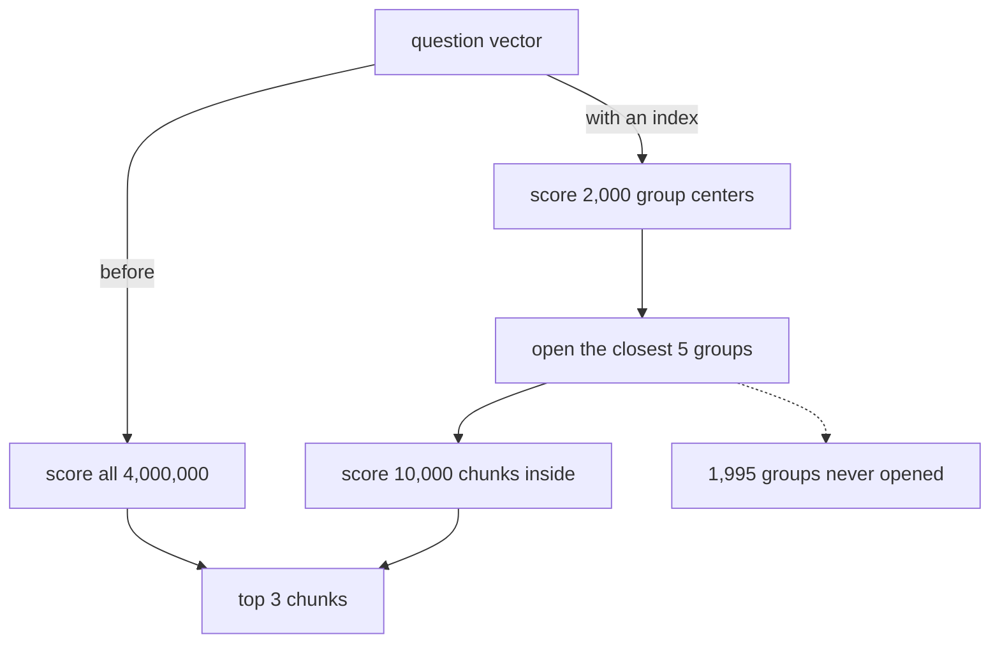

# 060: where the vectors actually live

builds on: [059](./059-search-the-chunks-then-paste-them-in.md), [013](./013-cosine-similarity.md), [021](./021-search-by-meaning-end-to-end.md)
arc: giving the model your data (5 of 15), ~2 min

059 ended on a loop that scores every array in the store. heres what replaces it once that pile gets big.

the grouping happens once, up front, not per question, and that prebuilt grouping is the index. every chunk vector gets dropped into a neighbourhood, and each neighbourhood keeps one array sitting at its middle. those middles are what the question meets first. about 12,000 comparisons instead of 4 million, and 013s cosine is still the only math here.

now the part that made me sit up. those 1,995 unopened groups might be holding the best chunk in the store, and nobody checks. thats what approximate means. its me hunting for methi at the supermarket, i go straight to produce, and if its in the frozen aisle im going home without it.

so you get a knob. open more groups, better odds, slower search. thats the whole tuning story, and that job is basically what a vector database sells you. other index shapes exist, some hop along a graph of neighbours instead, but the trade is the same.

i figured giving up exact search would sting a bit. turns out exact was never the goal, it was just what a small for loop handed me for free.
