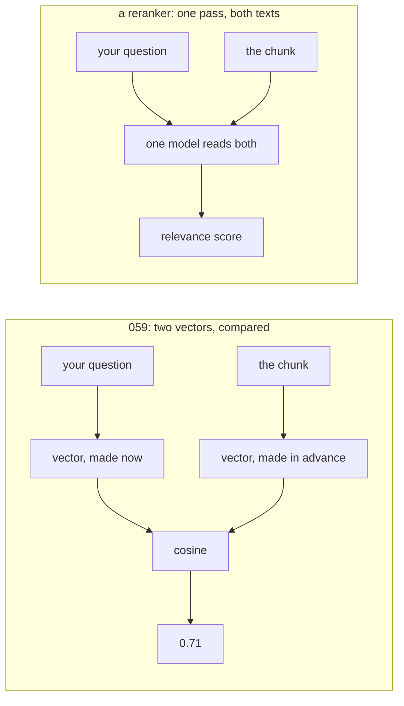

# 065: the score that read your question

builds on: [064](./064-two-searches-one-ranking.md), [059](./059-search-the-chunks-then-paste-them-in.md), [014](./014-what-an-embedding-is.md), [023](./023-attention-every-token-looks.md)
arc: giving the model your data (10 of 15), ~2 min

064 merged two lists by throwing the scores away, and the order is what it cost. deadlines.md and tools.md came out tied at 0.25 and rank fusion has nothing left to say about them. so i went looking for a better score.

start on the 059 side. the chunk turned into floats when it landed, weeks before you typed anything, and 014 already said the whole thing gets squashed down to one row. i knew that. what i missed is that the squashing happens before your question exists. cosine is comparing two arrays made in separate rooms.

the reranker side is a different model doing a different job. question and chunk go in as one stream, so 023 applies and your question tokens look straight at the doc tokens. "deadline" can attend to "within 30 days of purchase". out comes one number.

its called a cross-encoder, both texts crossed into one pass. it costs a full model run per chunk, so its slow in a way cosine just isnt.

took me a minute to see why its better at all. both are a model producing a number. the difference is that one of them read your question.
