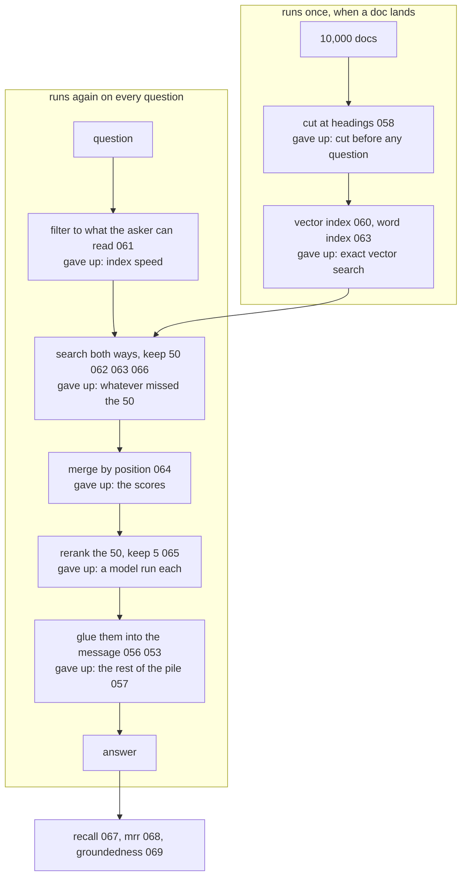

# 070: from my docs to an answer, end to end

builds on: [056](./056-closed-book-open-book.md), [057](./057-when-you-can-just-send-everything.md), [058](./058-cutting-the-docs-into-pieces.md), [059](./059-search-the-chunks-then-paste-them-in.md), [060](./060-where-the-vectors-live.md), [061](./061-filter-before-you-search.md), [062](./062-when-you-and-the-doc-use-different-words.md), [063](./063-the-search-that-understands-nothing.md), [064](./064-two-searches-one-ranking.md), [065](./065-reads-both-at-once.md), [066](./066-search-wide-sort-narrow.md), [067](./067-did-the-right-chunk-come-back.md), [068](./068-where-in-the-list-it-landed.md), [069](./069-did-the-answer-come-from-the-docs.md)
arc: giving the model your data (15 of 15), ~2 min

069 finally opened the answer, and it was also the last empty box in this arc. so heres every brick wired into one system, with what each stage cost me written next to it.

one group runs once, when a doc lands. cut at headings (058), embed and index the pieces (060), build the literal word index alongside (063). everything in the other group runs again on every single question.

the filter goes in before the ranking, not after (061), because after it hands priya one chunk when three were hers the whole time. then two searches, since embeddings whiff on your internal tool name and keyword search whiffs on money back meaning reimbursement (062, 063). merging by position throws the scores away (064), which leaves a list thats roughly right and mush inside, and thats the exact job the reranker takes over (065). it only ever reads the 50 that survived, never the store (066).

the last hop is still string concatenation. five chunks glued into a message (056), fighting for room in the same budget as everything else (053). theres no documents parameter anywhere in this, and yes, i went looking.

heres what i didnt see until i drew the boxes. read the gave up line in every box. how many of those would page you at 3am? none of them. a filter in the wrong order, a stage 1 slice thats too narrow, both of those still ship five chunks and a confident answer and a ui that looks completely normal.

so the three numbers hanging off the answer arent an extra. recall (067) asks did the chunk come back at all, mrr (068) asks how near the top it landed, groundedness (069) asks whether the answer used it. they stand in for the error this pipeline never throws.

which is arc 7. the four questions i wrote by hand in 067 arent an answer key, theyre a placeholder for one.
