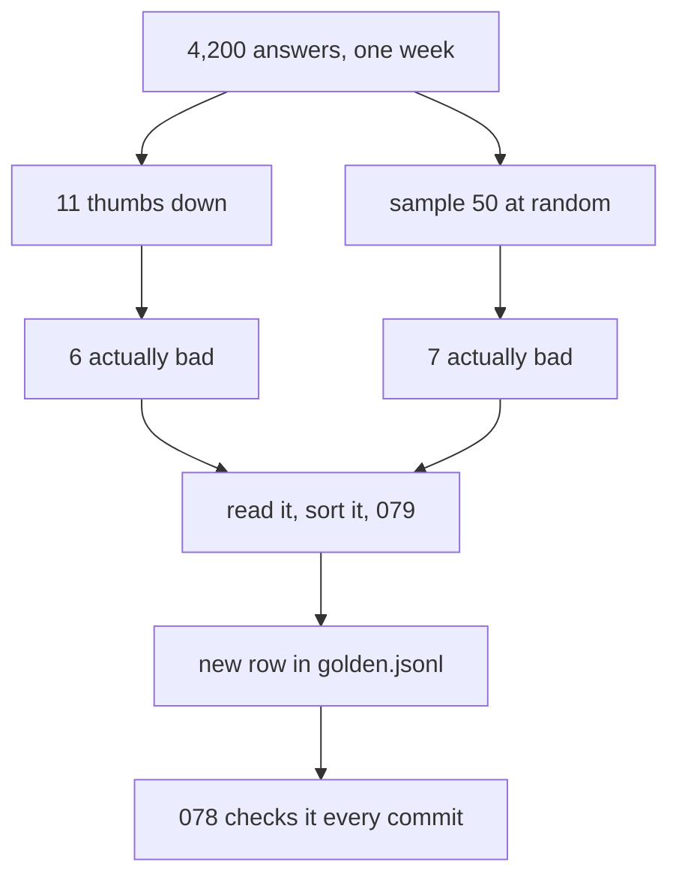

# 080: after you ship, who tells you its broken

builds on: [079](./079-read-the-failures-sort-them-into-piles.md), [078](./078-what-turns-the-build-red.md), [072](./072-the-same-questions-every-run.md)
arc: evals, how you know any of it works (10 of 11), ~2 min

079 ended on the failures picking themselves once its live. they do. they just dont tell me.

thumbs down arrives on its own and costs nothing, which is why i thought it was the feedback loop. its a two line component in the react app. 11 clicks on 4,200 answers. i opened all 11, only 6 were actually bad. the other 5 were correct answers to a question the person didnt mean to ask.

so i read 50 answers picked at random instead, nobody had complained about them. 7 bad. at 4,200 thats somewhere near 600 bad answers in a week where 6 raised a hand. 076 says dont trust a count off 50 rows, fair, so halve it. 300 against 6.

the part that got me is who doesnt click. someone who reads a confident wrong paragraph and believes it has nothing to complain about. you never hear from that one.

after that its 079 again, open it, sort it, and the question becomes a new row in golden.jsonl. thats the payoff, 078 re-checks that row on every prompt commit from then on. and per 072, add the rows first, then re-run the old prompt.

the file starts as 50 questions i made up. give it a month of this and its questions people actually typed.
