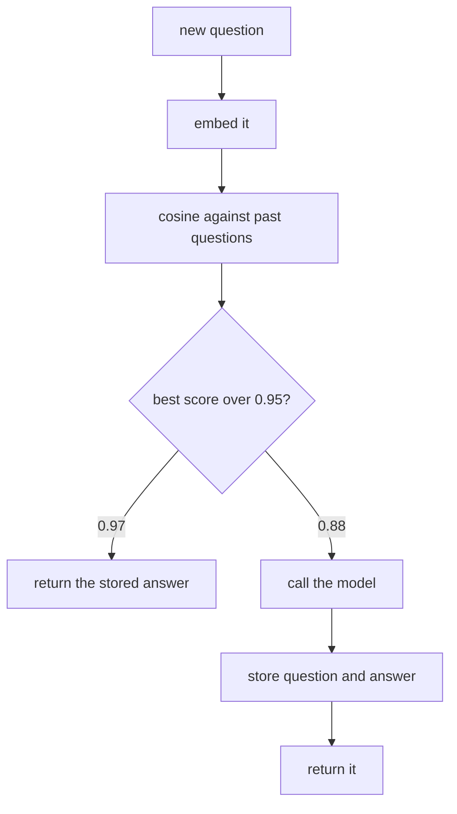

# 086: the same question twice shouldnt cost twice

builds on: [085](./085-the-part-that-never-changes.md), [013](./013-cosine-similarity.md), [014](./014-what-an-embedding-is.md), [019](./019-near-duplicates-and-a-threshold.md)
arc: running it, speed, cost, and when things break (5 of 11), ~2 min

085 made the prompt cheaper and the model still ran. this one doesnt call the model at all.

here the cache key is what the question means. embed it (014), cosine it (013) against questions youve already answered, and if the best match clears your line, hand back the stored answer. no tokens, no waiting. a bot answering "wheres my order" for the four hundredth time today pays for the first one.

i went in thinking this was the easy win and it really isnt. 085 cannot be wrong, the bytes match or they dont. this one can be, because a high cosine doesnt mean same question. "how do i cancel my order" and "how do i cancel my subscription" sit one word apart and the embedding barely flinches. thats 019s threshold showing up again, except now a false positive means confidently handing somebody the answer to a question they didnt ask.

so it fits where questions repeat and answers hold still. faq, docs, onboarding. i wouldnt put it anywhere the answer depends on who is asking. two people typing the same words want different answers back.

and hits go stale. "our refund window is 14 days" keeps getting served the day it becomes 30, until something clears it.

both caching notes come down to the same two numbers, what a call costs and how long you wait. 087 puts real ones on them.
