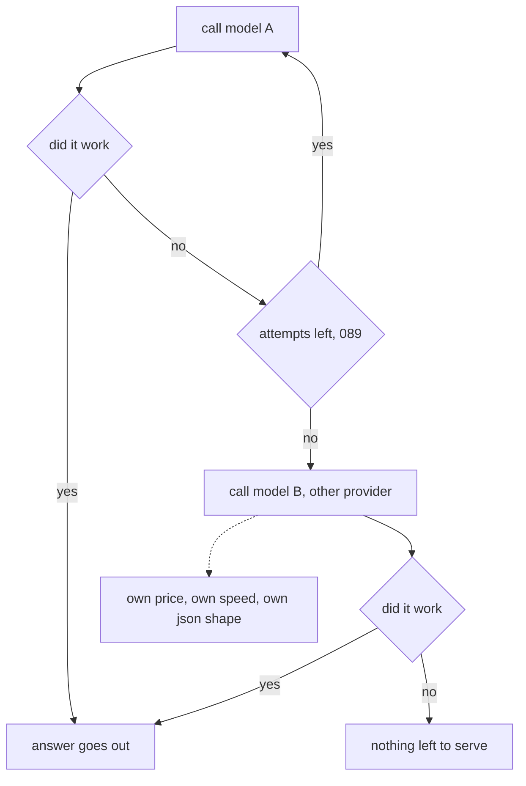

# 093: a second model, when the first one is down

builds on: [092](./092-how-long-before-you-stop-waiting.md), [089](./089-wait-then-double.md), [072](./072-the-same-questions-every-run.md)

arc: running it, speed, cost, and when things break (12 of 16), ~2 min

092 left me at the exact second the last attempt times out. i had never written the line after that one.

giving up doesnt have to mean giving up. anthropic being down doesnt mean openai is, so that branch is one more call, same question, different door. thats the whole idea and it took me about ten seconds.

then the part i had wrong. i was picturing a config line, a spare url sitting in an env file. its a second integration. model B bills at its own rate, answers at its own speed, and has its own opinion about what json looks like, so 050s validation is now guarding two shapes instead of one. my prompt was written against model A. every eval row in arc 7 was scored against model A.

which means the fallback path is the only path youve never tested, and it runs on the worst day you have.

so point your golden set (072) at the backup and see what it scores. one caveat, this is for the provider being down. a 400 from your own bad request (091) is a 400 at model B too.
