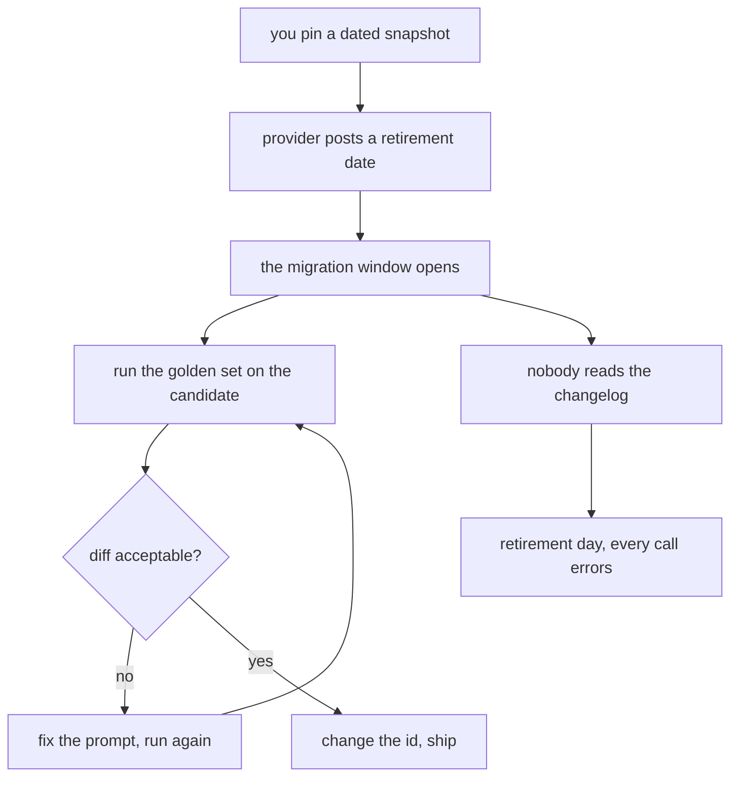

# 096: the version you pinned has an end date

builds on: [095](./095-a-date-or-a-moving-pointer.md), [072](./072-the-same-questions-every-run.md), [077](./077-fixed-five-broke-two.md)
arc: running it, speed, cost, and when things break (15 of 17), ~2 min

095 sold you on pinning. heres the bill. a dated snapshot doesnt run forever. the provider publishes a retirement date, and on that day the id stops answering.

the announcement is the part that got me. it lands as a changelog post, or an email to whoever created the account, so it never touches your logs. months of nothing. then one morning every call fails at once, and its not a 429 or a timeout, its a bad model id, so waiting doesnt help (089).

the window is the whole thing. you usually get months, and the work in there isnt find and replace on a string. changing that id changes the model, so point the golden set (072) at the candidate and read the diff the way 077 taught. editing the config takes a minute. the migration is the diff.

notice periods vary, and some providers route a retired id to its successor for a while, but leaning on that puts you back in 095, a model that moved and nobody told you.

.NET has an end of support date and nobody at work argues with it. i had nothing written down anywhere for a model id. when did you last read a provider changelog?
