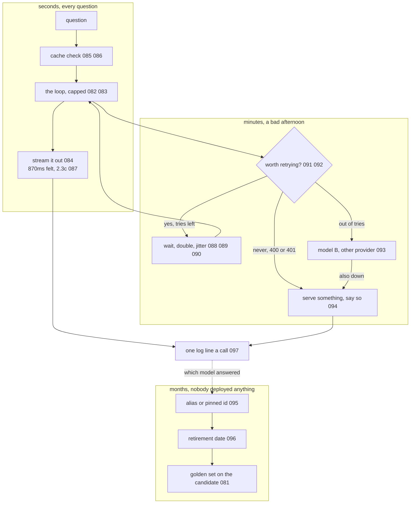

# 098: everything you write around one model call

builds on: [081](./081-the-harness-in-four-files.md), [082](./082-a-while-loop-with-a-model-inside.md), [083](./083-when-the-loop-wont-stop.md), [084](./084-why-the-ui-types.md), [085](./085-the-part-that-never-changes.md), [086](./086-the-same-question-twice.md), [087](./087-the-two-numbers.md), [088](./088-two-meters.md), [089](./089-wait-then-double.md), [090](./090-everyone-wakes-at-once.md), [091](./091-not-every-error-deserves-a-retry.md), [092](./092-how-long-before-you-stop-waiting.md), [093](./093-a-second-model-when-the-first-is-down.md), [094](./094-when-every-attempt-is-gone.md), [095](./095-a-date-or-a-moving-pointer.md), [096](./096-a-date-somebody-else-picked.md), [097](./097-what-your-http-log-is-missing.md)
arc: running it, speed, cost, and when things break (17 of 17), ~2 min

097 gave me the log line, and that was the last empty box in this arc. so heres the whole thing wired up, one deployed doc-QA feature and the three clocks it runs on.

the seconds group is one question on a good day. caches first, one of them makes the call cheaper and the other skips it entirely (085, 086). then the loop from 082 with 083s caps taped on, and the answer streams (084) so the wait a person feels is 870ms instead of the 2,870 the whole thing takes (087).

the minutes group is that same code on a bad afternoon. is this worth sending again (091), how long before i call it hung (092), then the sleep with the doubling and the random slice on it (088, 089, 090). tries run out, theres a second provider (093). a bad api key skips that whole branch, since it fails the same way at model B, and lands straight on what you serve when nothing answered (094).

the months group breaks with nobody touching the code. an alias moves under you, or a pinned id hits its retirement date (095, 096). one of those is silent and the other is every call failing at once, and the golden set from arc 7 is what you point at the replacement either way (081).

then i counted the boxes. every one of them is code i wrote. the model call is a single line sitting in the middle of the loop, and the other sixteen notes in this arc are the ring around that line. i had the whole arc filed in my head as the ai part of the job. almost none of it is. its caching, retries, timeouts, version pinning and logging, the same wrapper my react app already puts around a flaky endpoint at work.

which of the three clocks does your code handle today? mine handled seconds. it shipped anyway.
