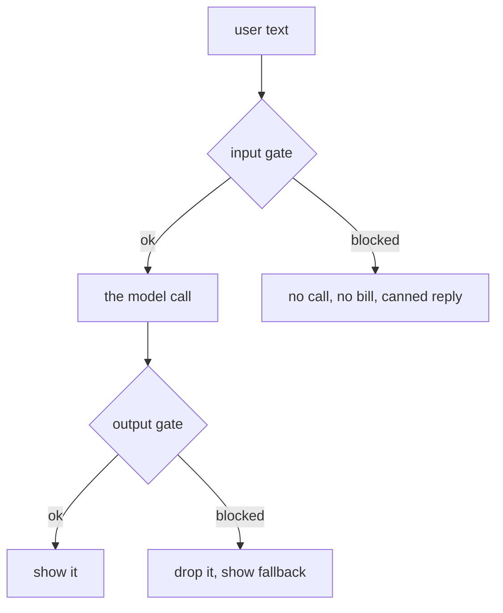

# 100: one check before the call, one after

builds on: [099](./099-should-this-even-be-a-model-call.md), [052](./052-when-the-text-isnt-mine.md), [018](./018-classify-with-no-training.md), [038](./038-why-the-made-up-answer-sounds-right.md)
arc: the decisions, safety, privacy, and picking your model (2 of 10), ~2 min

099 sorted out which jobs a model should keep. this is the first thing i put around one of those jobs before real users touch it.

two checks, not one. the input gate reads what the user typed and decides whether we even make the call. it catches the obvious abuse, and it catches the 052 case where somebody pastes instructions meant for the model. blocking here is cheap since you never pay for the call.

the output gate is the one i underrated. i assumed a good input filter covers you. it doesnt, because the model writes something new every time and nothing in the input tells you what that will be. a completely polite question can come back with an invented refund policy (038) or another customers name in it. the input gate cant see the future.

both gates are classifiers (018), and a classifier is wrong in two directions. block something fine and the user notices and complains. let something through and nobody tells you, you find out from a screenshot later. so you dont really pick a filter, you pick which of those two you can live with. for our support inbox i would take the annoyed user. for a coding assistant that answer probably flips.

you dont get to have neither.
