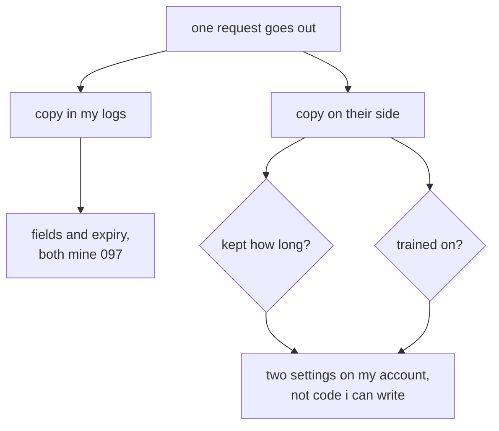

# 103: every call makes two copies

builds on: [102](./102-swap-it-out-swap-it-back.md), [101](./101-whats-in-the-request-nobody-typed.md), [097](./097-what-your-http-log-is-missing.md)
arc: the decisions, safety, privacy, and picking your model (5 of 10), ~2 min

102 took the card number out of the request. this is about the part that still leaves.

one call, two copies, and i kept forgetting the one on my own disk. i was busy worrying about the provider while my log line (097) sat there holding prompt text in a store nobody had ever put an expiry on. that copy is entirely mine. the fields, the window, and the breach if it happens.

the other copy is the one i cant write code against. heres the bit i had backwards: how long they keep it and whether they train on it are two separate settings. i read them as one question. a provider can hold a request for a few weeks for abuse checks and train on none of it, and the consumer chat app and the api from the same company often answer differently.

so go look at the plan youre actually on. how long they hold it, thats the retention window, and separately whether training is on by default. both of those are account settings, not a pull request. first thing in this arc i cant fix in my own repo.
