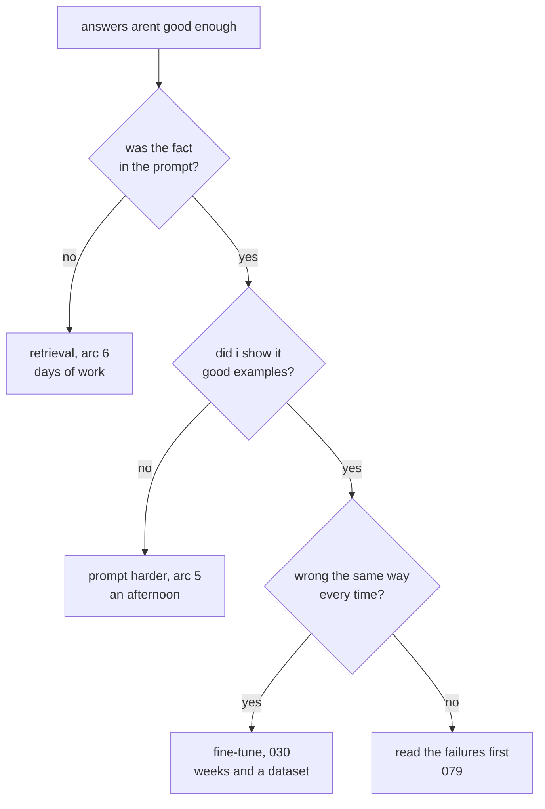

# 106: three fixes, and they dont fix the same thing

builds on: [105](./105-rent-it-or-own-it.md), [030](./030-fine-tuning-shape-not-facts.md), [056](./056-closed-book-open-book.md)
arc: the decisions, safety, privacy, and picking your model (8 of 10), ~2 min

105 was a decision sitting above my code, who runs the model. same altitude here, turned back inward. the thing works, its just not good enough, and theres three moves on the table.

i used to read these as one knob at three strengths, weak, medium, strong. theyre not. the fact question is the whole note. if the fact was never in the prompt, rewording doesnt put it there (056), and 030 said tuning teaches shape and tone, not facts, so that doesnt put it there either. retrieval is the only one of the three that adds knowledge.

and fine-tuning, the one that sounds like actual engineering, is the one i reach for last now. took me a while to stop reaching for it first. it earns its cost when the model already knows enough and keeps getting it wrong the same way, same broken format, every single time.

they stack too. most of what i ship is a prompt plus retrieval, and tuning goes on top, not instead.

so which is yours, missing facts or missing instructions? ten failures usually tell you.

107 is the other half of this decision, which model you point it all at.
