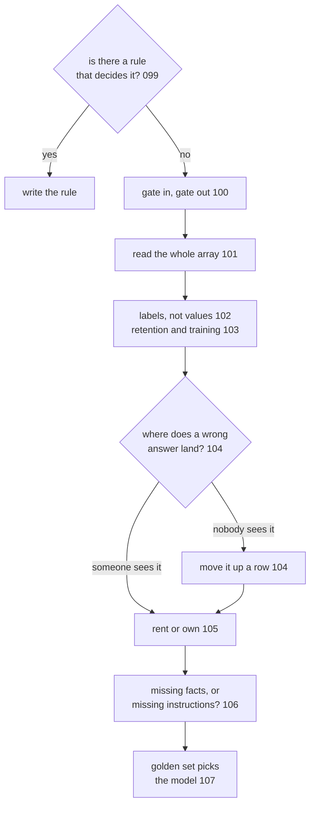

# 108: the questions i ask before shipping any of this

builds on: [099](./099-should-this-even-be-a-model-call.md), [100](./100-two-gates-around-the-call.md), [101](./101-whats-in-the-request-nobody-typed.md), [102](./102-swap-it-out-swap-it-back.md), [103](./103-every-call-makes-two-copies.md), [104](./104-ten-wrong-answers-a-day.md), [105](./105-rent-it-or-own-it.md), [106](./106-three-fixes-that-fix-different-things.md), [107](./107-the-ranking-hasnt-seen-your-task.md)
arc: the decisions, safety, privacy, and picking your model (10 of 10), ~2 min

107 handed the model pick to my golden set, and that was the last open question in this arc. so heres all nine of them, in the order i actually ask them.

the rule question is the cheapest one here and i used to skip straight past it. if a rule already decides the answer, write the rule (099), and every other question here turns into work you never have to pay for.

once a model really is the answer, the gates go on first, one reading what came in and one reading what came back (100). then i read the request array out loud, all of it, since the line a human typed today is usually the smallest thing in there (101). whatever can travel as a label travels as a label (102), and the leftovers arent code at all, theyre two settings on your account, how long they keep it and whether they train on it (103).

the wrong answer question is the one i still argue with people about. same model, same accuracy, and the only thing moving is whether anyone sees the answer before it takes effect (104). when nobody does, you put a person in the loop, and thats a product change rather than a prompt change.

the last three run together in practice. rent until traffic makes owning cheaper, and owning drags the whole provider job in with it (105), then missing facts or missing instructions, because retrieval and prompting and tuning dont fix the same thing (106), then the id itself, decided by your own 50 examples (107).

heres what i counted at the end. only the last three of the nine are about the model. the other six are about scope, safety and privacy, and where a wrong answer lands. i opened this arc thinking these were technical decisions. go count how many of yours are.
