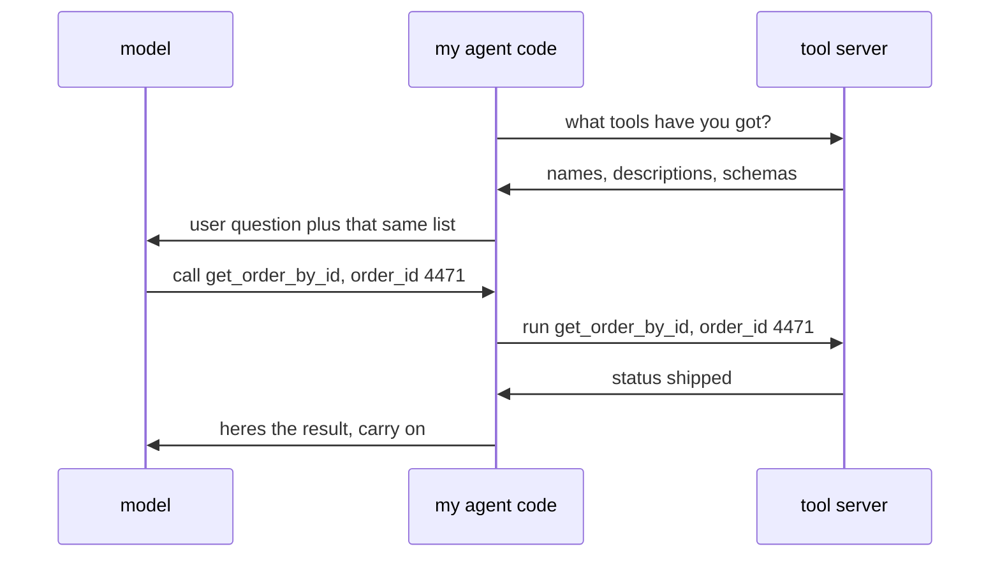

# 112: any agent, any toolbox

builds on: [111](./111-the-arguments-cant-come-out-malformed.md), [110](./110-the-toolbox-is-written-in-english.md), [051](./051-the-model-asks-your-code-acts.md)
arc: agents, when output starts doing things (4 of 13), ~2 min

110 and 111 finished describing a tool, its name, its description, its schema. both notes quietly assumed i typed that toolbox into my app myself.

the new part is my code asking a tool server what it has, and getting back the exact three things 110 and 111 built. it pastes that list into the request. from there its 051 unchanged, model asks, my code acts.

so the toolbox went from source code in my app to something fetched at runtime. three apps and three toolboxes used to be nine bits of hand written glue, one per pair. put one agreed shape in between and its three and three, and a tool written once is offered to anything that speaks it.

if your agent and your tools sit in one repo you wont feel this yet. wait til theres a second agent.

theres a published standard for the handshake now, mcp, model context protocol, an agreed way to ask a server what it can do and then ask it to do one.

the bit i kept misreading: the model is not connected to any of this. it still only reads text and writes text. my code holds both wires.

at my day job an npm package is something i install once and import anywhere. tools werent like that. now they can be.
