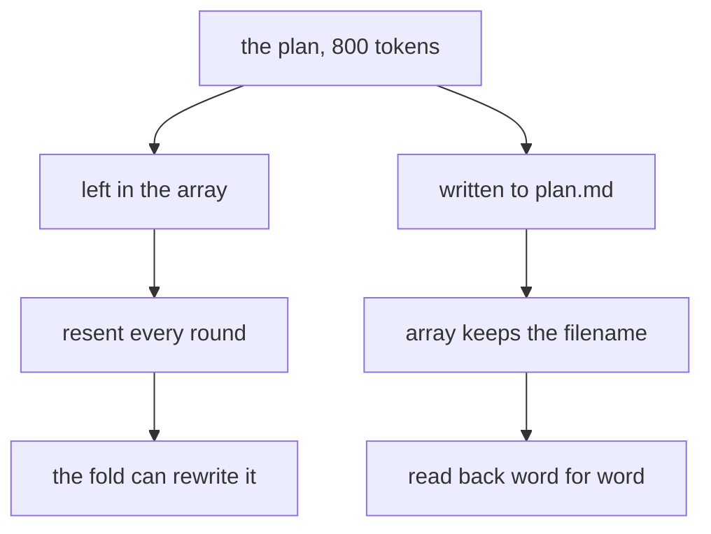

# 118: the plan is just tokens, a file is real memory

builds on: [117](./117-fold-old-rounds-into-a-summary.md), [115](./115-one-round-itemized.md), [110](./110-the-toolbox-is-written-in-english.md), [051](./051-the-model-asks-your-code-acts.md)
arc: agents, when output starts doing things (10 of 13), ~2 min

the fold in 117 rewrites the oldest rounds, and whatever it dropped is gone. so anything that still has to be true on round 20 shouldnt be sitting in the array at all.

say the model writes an 800 token plan on round 3. leave it as a message and i already know the bill from 115, thats 800 tokens replayed on every round after it, so ten more rounds is 8,000 tokens of the same six steps. then the fold runs and a summariser decides which of those steps survive.

write it to plan.md instead and the array keeps one short line, wrote plan.md, 6 steps. round 14 the agent calls read_file and gets its six steps back exactly as written.

the caveat, reading it back costs the 800 tokens again on that round. you pay when you need it instead of forever, and you get the original, not a summary of it.

feels obvious now, wasnt this morning. its a grocery list. in my head it drifts by the time im at the shop, on paper it doesnt.

none of this works unless the toolbox from 110 has a read and a write in it. 119 is the other way to keep the array small.
