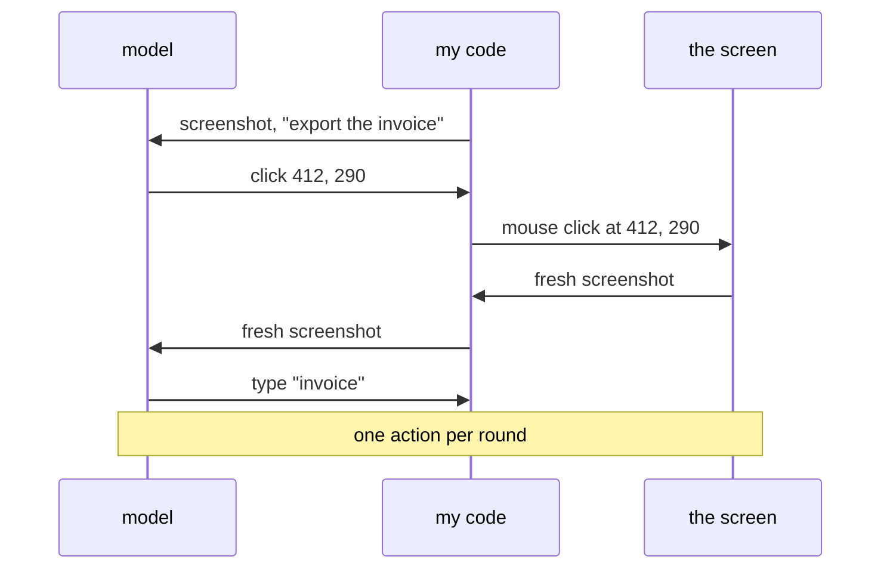

# 120: computer use, when the tool is the screen

builds on: [119](./119-a-fresh-window-with-a-narrower-job.md), [109](./109-when-the-answer-stops-being-a-suggestion.md), [054](./054-sending-an-image.md), [082](./082-a-while-loop-with-a-model-inside.md)
arc: agents, when output starts doing things (12 of 13), ~2 min

119 made a tool whose body was a whole other loop. computer use goes somewhere else, the tool is a screen. what comes back is a screenshot and what the model sends is a coordinate.

its still the loop from 082. the observe step is a picture now. my code grabs a screenshot, puts it in the array the way 054 puts in any image, and the model answers with where to click. the code does the clicking, grabs another screenshot, round two.

took me a minute to accept theres no dom in here. in my react work i grab a button by its test id and it either exists or it doesnt. the model gets pixels, finds the button by looking, and hands back two numbers. if a banner pushes the page down 40 pixels, those numbers now point at something else, and you find that out from the next screenshot rather than from an error.

so why bother. because some things have no api. an internal desktop tool, an admin screen from 2011. the screen is the only interface there is.

a click is 109s output that acts, and it acts on whatever is under it. arc 11 gets to deal with that.
