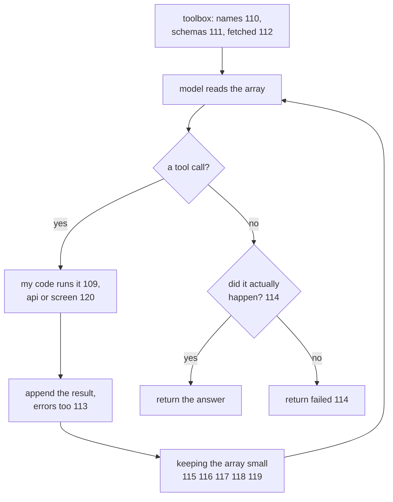

# 121: the working agent, assembled

builds on: [109](./109-when-the-answer-stops-being-a-suggestion.md), [110](./110-the-toolbox-is-written-in-english.md), [111](./111-the-arguments-cant-come-out-malformed.md), [112](./112-any-agent-any-toolbox.md), [113](./113-a-failed-tool-call-goes-back-in.md), [114](./114-no-tool-call-isnt-done.md), [115](./115-one-round-itemized.md), [116](./116-truncate-or-paginate.md), [117](./117-fold-old-rounds-into-a-summary.md), [118](./118-files-are-the-agents-real-memory.md), [119](./119-a-fresh-window-with-a-narrower-job.md), [120](./120-when-the-tool-is-the-screen.md)
arc: agents, when output starts doing things (13 of 13), ~2 min

120 ended on a click landing wherever it lands and handed that to arc 11. this arc is finished. so heres all twelve parts in one picture, the loop from 082 with everything this arc built bolted onto it.

the loop hasnt changed since arc 8. read the array, get a reply, run something, go round again. every note in this arc hangs off a step in it.

the toolbox is the input i kept underestimating. the name and the description do the picking (110), the schema clamps the arguments so they cant come out malformed (111), and none of it has to live in my repo, a server can hand the list over at runtime (112). all three reach the model as text.

running the call is where the answer stops being a suggestion (109). what comes back is text, or a screenshot when the system has no api (120), and when it fails the error goes into the array as that calls result, not up as an exception (113).

then the part i didnt expect to be half an arc. every result stays in there and rides along on every round after (115). so cap what one result puts in (116). fold the oldest rounds when the ceiling gets close (117). write anything that has to survive to a file (118). hand a whole sub-job to a window that throws itself away (119).

the exit gets a check of its own, because the model going quiet is not the same as the job being done (114). one query against my own database. a no there is a failed run, not another round.

heres what i noticed drawing this. every check in that picture asks did it work. not one of them asks should this have run. issue_refund goes through because the model asked for it and my code was already holding the wire. go look for the line in your agent that says no.
