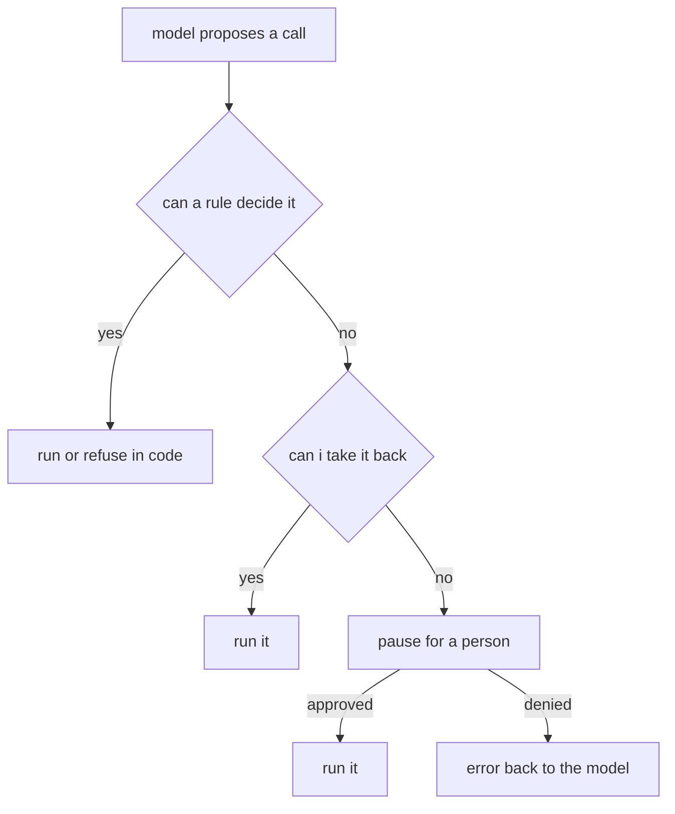

# 125: the gate that doesnt drown you

builds on: [124](./124-hand-the-tool-less-power.md), [122](./122-what-a-wrong-call-leaves-behind.md), [113](./113-a-failed-tool-call-goes-back-in.md)
arc: agents you can trust (4 of 12), ~2 min

124 moved the limit into the tool body, so a bad call hits a return before anything runs. that only covers what i can write down as a rule in advance. some calls are only decidable in the moment, and thats where a person comes in.

the pause itself is nothing clever. before your code runs the call, it checks a policy. if the answer is ask, the loop stops and waits. approved, it runs. denied, the denial goes back as a tool result, so 113 still holds, the model reads it next round and tries something else.

the part that matters is how few calls reach that branch. every one that does spends a persons attention, and attention runs out fast. you know what you do with a dialog that pops up on every action. you stop reading it and click yes. a gate that fires on everything is a rubber stamp with extra latency.

so the calls that pause are the ones from 122s last column, the ones i cant take back, minus whatever 124 already made impossible. if one of those still fires constantly, thats a tool that needs a tighter rule, not a person who needs to click faster. every question you turn into a rule is a question nobody has to answer.

i had this backwards going in. i assumed approval was the main safety feature and the code checks tidied up around it. its the other way round. the gate is the leftovers.
