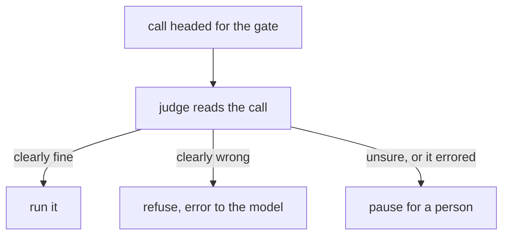

# 130: the judge moves in front of the gate

builds on: [129](./129-a-model-reads-the-trace.md), [125](./125-the-gate-that-doesnt-drown-you.md), [123](./123-injection-grows-hands.md)
arc: agents you can trust (9 of 16), ~2 min

129 runs the judge after the fact, on a run thats already over. nothing it says changes what happened. put the same call before the action instead and it stops being a measurement. now its a control.

it sits in front of 125s pause, not instead of it. a call that would have woken somebody hits a model first, and only what that model cant settle goes on to the person. same queue, shorter.

three exits, and only one can hurt you. refusing is safe, a wrong refusal goes back as a tool result and the model tries something else, thats 113. the person is safe, thats where we already were. run it is the branch that spends trust, and its exactly what a poisoned tool result aims at, because this judge reads the same context 123 planted.

the first version i sketched had two exits, approve or deny. thats the bug. when the judge times out or hands back json i cant parse, two exits means im guessing. anything short of a confident clear falls through to the person. fail closed.

it isnt free either. thats a model call in the path now, so every risky call gets slower, and thats coming out of 087s budget.

its the spam filter in front of my inbox. it doesnt read my mail for me. whats left is worth opening.
