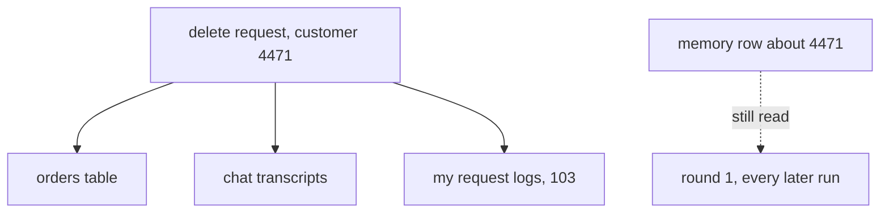

# 134: a memory row is a second copy

builds on: [133](./133-the-key-decides-who-reads-it.md), [131](./131-a-store-that-outlives-the-run.md), [103](./103-every-call-makes-two-copies.md)
arc: agents you can trust (13 of 17), ~2 min

133 asked who gets to read a row back. this one asks how long they get to.

that delete is a list i wrote by hand. orders, transcripts, my own log store from 103, every place i knew data lived. the memory row is not on the list, and nothing made me think of it, it gets written in a different corner of the code, at the end of a run, by a model.

so its a second copy that no cleanup path knows about. no delete reaches it, and nothing dates it either, so the customer can close their account and that row is still sitting in round 1 a year later, keyed under whatever 133 landed on.

heres the part that got me. i kept calling that store a cache. a cache is a copy you can throw away, the real version lives somewhere else. this one has no somewhere else. it got squeezed out of a run that already ended, so once the transcripts go its the only version left.

and the fix costs something. an expiry means picking a window and accepting the agent forgets things worth remembering. thats a decision, not a bug.

if youve ever written a delete-user endpoint you know the shape, a list of tables held in somebodys head. this store isnt on anybodys.
