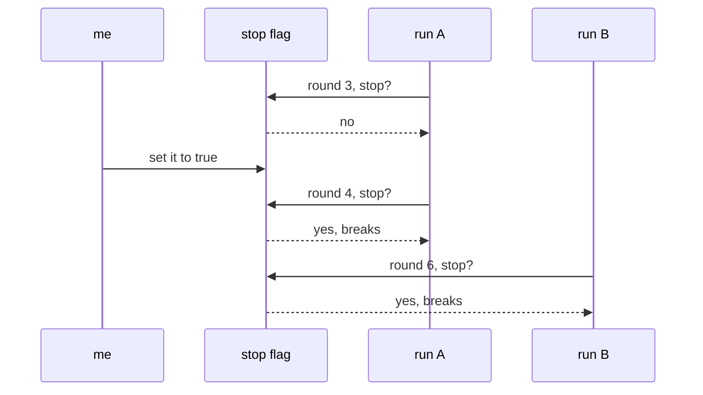

# 136: the stop i flip by hand

builds on: [135](./135-the-cap-that-stops-a-run.md), [122](./122-what-a-wrong-call-leaves-behind.md)
arc: agents you can trust (15 of 17), ~2 min

135s cap is a number the run works out about itself. this one comes from outside, and its job is the runs already going.

the flag is one row that my code and every loop can read. i set it. each run reads it fresh at the top of a round and breaks if its true.

took me a while to accept why it works this way. you cant reach into a loop thats already running. a deploy doesnt touch it, a config change doesnt touch it, both land on the next run while this one is mid round 3. the loop has to go looking for the stop itself. so a kill switch isnt a kill, its a question the loop asks every round. reading one row costs nothing next to a model call.

the price is it lands at the next round, not now. run B is in a slow tool call when i flip it, so it keeps going until it comes back around, and it stops as arbitrarily as 135 warned, half-finished in the way 122 describes. the actual kill is killing the process, same mess and no record of it.

if youve passed a cancellation token around in .net, you already know the shape. code that never checks the token never stops.
