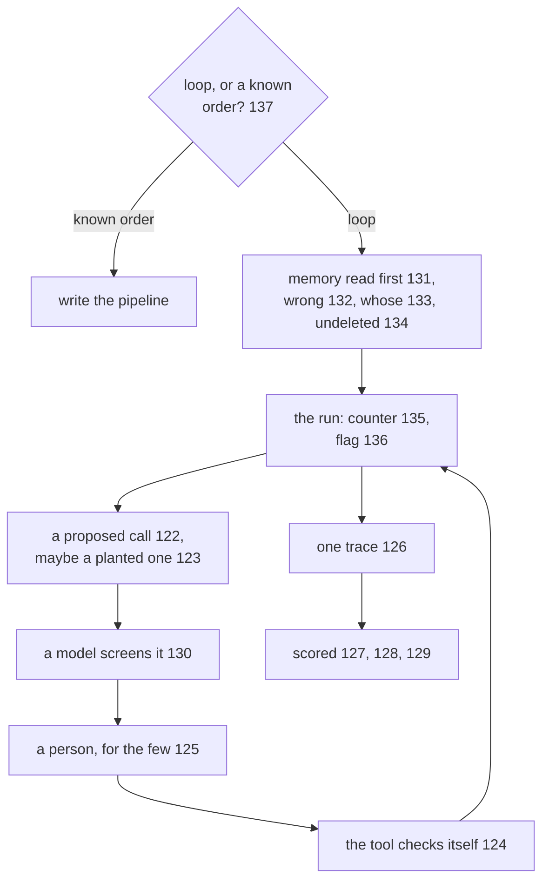

# 138: the trusted agent, assembled

builds on: [122](./122-what-a-wrong-call-leaves-behind.md), [123](./123-injection-grows-hands.md), [124](./124-hand-the-tool-less-power.md), [125](./125-the-gate-that-doesnt-drown-you.md), [126](./126-a-trace-not-a-log-line.md), [127](./127-grade-the-end-state.md), [128](./128-count-the-steps.md), [129](./129-a-model-reads-the-trace.md), [130](./130-the-judge-moves-in-front-of-the-gate.md), [131](./131-a-store-that-outlives-the-run.md), [132](./132-a-bad-row-outlives-the-run.md), [133](./133-the-key-decides-who-reads-it.md), [134](./134-a-second-copy-nothing-deletes.md), [135](./135-the-cap-that-stops-a-run.md), [136](./136-the-stop-i-flip-by-hand.md), [137](./137-when-i-didnt-need-the-loop.md)
arc: agents you can trust (17 of 17), ~2 min

137 said write the steps out, and if you can, you didnt need the loop. say you tried and the loop survived it, the next step really does depend on what the last one found. then all sixteen of these are yours. arc 11 in one picture.

the question that comes before all of it isnt inside the loop, its whether theres a loop at all (137).

past that, what decides how much machinery a call gets is what a wrong one leaves behind and whether you can take it back (122). thats why a plain lookup can need a gate and a refund might not. and the call isnt always the users idea, a planted line in a tool result asks for one in exactly the same voice (123).

so three things sit between a proposed call and the wire. a model reads it and refuses, clears it, or passes it up (130). a person gets the short list thats left (125). the tool checks the caller and its own arguments when it actually runs (124), because a sentence in the system prompt was never a permission system.

the run carries a counter that ends it (135) and reads a flag i can flip from outside while its still going (136).

memory is the part that surprised me. one row read before round 1 (131), and it can be stale or planted (132), filed under a key too wide (133), and sitting off every delete path you have (134).

then afterwards, one trace of the whole run (126), a pass or fail off the end state (127), a judge reading the path when theres no row to look up (129), rounds and tokens next to the pass (128).

drawing this, the thing that got me is how little of it is about the model. sixteen notes and not one of them changes a prompt.
